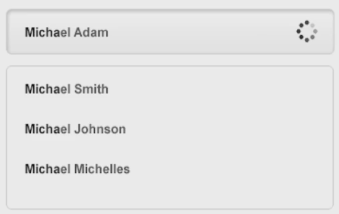

# Introduction

A search box is something that virtually every website should have, and it's quite an easy graphical element to create. We're going to make a simple minimal search box that can be adjusted to fit different types of menus or sidebars.

# Designing the search box

* Select the round rectangle tool.
* Set the radius to about 5 pixels.
* Choose the white color.
* Deselect the edges with `Ctrl+Shift+H` if it's needed.

Now we are going to add a a light grey stroke. I suggest you take a look at what greys good-looking websites use - you can easily copy them by using the color picker tool on a print screen.

* Go to the fx panel.
* Set the size to 1 pixel.
* Make the stroke to be outside.

Next add the slightest white to grey gradient, just to give the box a bit of an edge.

* Go to Layer Style > Gradient Overlay.
* Select Inner Shadow.
* Set 2 pixels distance.
* Set 4 pixels size.
* Set 20% opacity.
* Choose one side of a gradient to be white while the other one to be very light grey.

Let's move on to the text aspect. Our search box will be something similar to Google - suggestions will appear as you type. 

* Write a name inside the search box (Arial, 14px), and set the color to a fairly light grey (`#555`).
* Select the first couple of letters, make them bold and change the color to black.
* Go to [iconfinder.com](http://iconfinder.com), and look for a loading icon. Drag it into Photoshop, and if needed, press Ctrl+T to resize (hold `Shift` to maintain proportions or use `Alt+Shift` to resize the object from all parts).
* Get the round rectangle tool and draw something the same width as the field above, but taller.
* Type in a couple of names that resemble the one up top (you may use `Alt+Shift` and drag to duplicate the layer).

* For the shape you made, change the shape color to white and add a subtle grey stroke and a drop shadow.
* Select the line tool, and drag from one side to the other. If needed, double-click the line to adjust the color.

# Copy layer styles

Another great thing is that you can right click the field, select Copy Layer Styles, create a more rounded shape, right-click that and select Paste Layer Style. This way you don't have to go through the process each time.