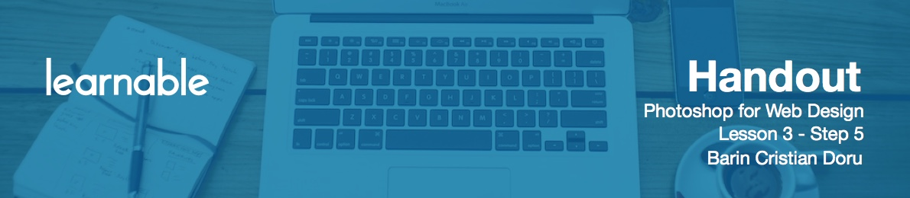
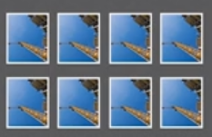
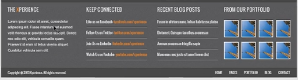

# Designing the footer

Let's move on to the footer.

* Make a rectangle as wide as the body.
* Go to Layer Effects and choose a pattern.
* Add text, some links and change the link colors.

# Creating separators

To create separators:

* Make two lines: one white and one black.
* Drop the opacity all the way down to about 10-20% until they're looking good, like they're pressed into the background.
* Group, rename and copy multiple times. Do the same for the other ones.

# Designing portfolio section

For Portfolio:

* Add some squares.
* Group and rename.
* Duplicate with `Alt+Shift` or `Ctrl+J`.
* Make sure you distribute them evenly.
* Replace squares with images.

# Adding footer details

* Hit the rectangle tool and drag along the width.
* For the bottom part, drag another rectangle, make it the same color as the top line.
* Add an inner shadow from the fx panel.
* Set opacity to 20%, 1 pixel for distance, 1 pixel for size.
* Then add a copyright in the Menu items from up top.
* Group and rename.

Congratulations, we've just made our first project!

# Exporting project

To export the project as a *.jpg* file, go to File > Save for Web, select JPEG, and set the quality to Maximum. Try it out for yourself and see how it goes.