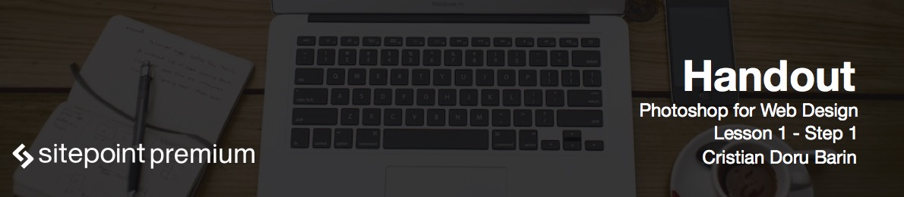

# Introduction to using Photoshop for web design

Using Photoshop for web designing purposes doesn't require a very creative nature, but more of an analytic, even mathematical approach. To become a great web designer, you will need **speed**, **efficiency** and **knowledge**.

Speed is the first step, because if you strive on being more efficient and knowledgeable, you want to do so in the shortest amount of time possible. It doesn't matter how good you are, if it takes you forever to achieve the result. As you create more and more projects, you will discover questions, and subsequently, reveal the answers.

On the other side, it doesn't matter how fast you are if you're going through unnecessary steps. You have to constantly choose the best path in order to achieve the result. This is a major challenge, because it ties up with the other two aspects.

You want to be as fast as possible, but you also have to decide what's the best option for the next task at hand. And the only way to achieve that is with knowledge. As you learn different techniques, hotkeys, and principles, you get a better understanding of Photoshop. As your knowledge grows, so does your creativity: you're no longer asking, "how can I do that?". Instead you ask "what's the best way to do that?". If you have speed and you're efficient in creating different graphical elements, it doesn't mean that they'll all magically fit together. You have to understand design principles so as to make your design flow. Every element you put in your website must go well together with the rest of your graphics in order to create a certain effect through the page.

Thus, the triad is complete, and each area is very dependent on the others. 

# What's next

What I will show you in this course is how to create graphical elements like navigation bars, slideshow areas, search bars, galleries, and much more, while showcasing different techniques and hot keys. You will get accustomed even more with the tools we are going to use, and see the steps I go through when designing actual elements. Then, you can practice and create your own elements while constantly increasing your speed. This is your main goal for the moment, and then we'll see how all of these fit together in a website design.

So let's get started!