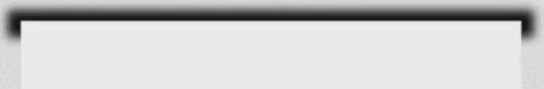
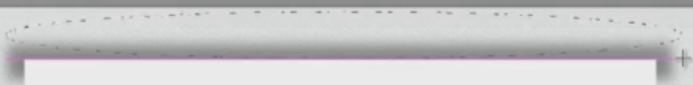

# Introduction to creating paper sheet effect

We're going to learn a simple yet powerful technique to work with the shadows. You already know how to use the Gaussian Blur filter effect but let's see where else we can use it.

* Employ the Rectangle Tool to create a shape.
* Add a background of some sort with a pattern or a gradient.

To make the shape look like a piece of paper, we could use the Drop Shadow effect but I don't think that's optimal.

# Adding shadows to top and bottom

Here is a better solution:

* Get the Rectangle Tool.
* Drag a wide, short shape and place it underneath the piece of paper.
* Use the Gaussian Blur from Filter > Blur and lower the opacity a bit.

* Grab the Elliptical Marquee Tool.
* Drag a selection.

* Press `Delete` - the sheet of paper will appear to be curled.

Of course, you might need to adjust the opacity to make sure it looks right.

* Undo with `Ctrl+Z`
* Use the Feather option up top.
* Drag the selection and press `Delete`. Notice, there's a softening of the edges. That's what feathering does, and as you increase the pixel count, the more feathered it will be.

After you're done with the top shadow, you can duplicate it.

* Drag it at the bottom
* Press `Ctrl+T`
* Flip it vertically.

# Adding shadows to the sides

How do you add these shadows to the side?

* Get the rounded rectangle tool
* Drag two shapes, one on each side.
* Either make them a Smart Object, or merge them.
* Make sure they are completely centered (use Align Horizontal Centers) on the screen.
* Use the Gaussian Blur option and lower the opacity.
* You can use the Elliptical Marquee Tool and delete a part of the shadow. Depending on how curled you want your page to look like, adjust the selection width.
* You can also move the selection by using `Shift` and one of your keyboard arrows to make sure it is the exact same on the other side (be sure to have the Marquee Tool selected and not the Move Tool).