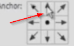

# Adjusting canvas size

Suppose you're creating a very long website, and you need more space on the bottom area. To enlarge your canvas:

* Go to Image > Canvas Size.
* Estimate how many pixels you'll need.
* Go on and add, for example, 300 pixels to the height.
* It is important to click on the up arrow. If you don't, Photoshop will add 150 pixels to the top, and 150 to the bottom - that's not what we want.

The same thing goes when you want to shrink your canvas.