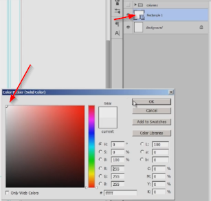
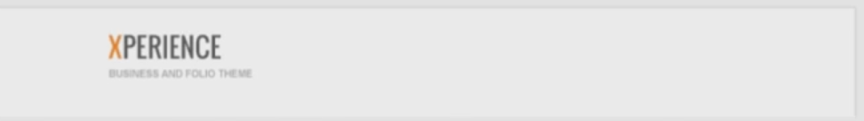
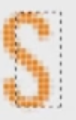
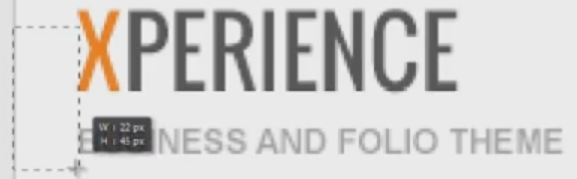
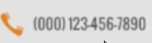
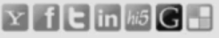

# Introduction

Our first project is copying a website designed in Photoshop. Download the accompanying archive and find the file *website_to_copy_in_chapter4.jpg*. The point is to put everything together and use it in the real world.

# Designing the header

Open up the 960 Grid file.

* Hit `Ctrl+;` to see the guides.
* Lock them with `Ctrl+Alt+;`.
* Drag the image with a sample website from your folder to the canvas.
* Hit `I` to select the Color Picker so we can take the background color.
* Click and check on the left side to see if the black changes to a light grey.
* Delete the image.
* Hit `G`.
* Click and we have our background color.

Now we have to save the project with another name so our grid PSD remains the same. Go to File > Save As, and save it with another name.

We're going to make the white body area that holds our content.

* Hit `U`, select the Rectangle tool, and create a shape.
* Go to the Layers panel and on the left side of the Layer name, double-click to change the color to white.

* Having the guides opened and the body layer selected, hit `Ctrl+T`, and make sure it's as wide as the outer guides. You can adjust the height as you go along.
* The body has a grey line around it. Add it by hitting the fx button at the bottom of the Layers panel and selecting Stroke.
* Set the size to 1 pixel.
* Set the color to grey. You can use the Eye Dropper tool on the original image to have the exact color code.

We need to set the font for our logo, menu, and everything else. This font is named Oswald and if you don't have it, go to [google.com/webfonts](http://google.com/webfonts) and download it.

* Drag the image back onto the canvas and use the Eyedropper to find the color.
* For the logo write "experience" and set it to all caps from the Character panel.
* Use the Eyedropper on the inspiration image to identify the color code for that orange.
* Press `T`, select the X and make it that color.
* Use a smaller font for the tagline and you can approximate that grey nuance.
* Select both text layers and press `Ctrl+G` to group them and rename the folders.
* Make sure both are aligned to the left by selecting them and using Align Left Edges from the top panel.

# Designing the main menu

Let's deal with the menu.

* Press `T` for the Type tool.
* Click and write the text - all on one line. Hit the numeric Enter from the right side of your keyboard to finish.
* If you didn't write it in all caps, go to the Paragraph panel and hit this button.

* Adjust the size if needed.
* Make sure you have the Type tool selected and click on the typed text.
* Go to end of Home and press `Space` multiple times, depending on what you think looks good.
* Copy that empty space and paste it into every single item so you have the exact same space between them.
* Select the home item, then the color from the Character panel and make it a dark orange. This is the down state, meaning you're on that page.
* Then select any other item and make it the same orange as the X and the logo. That's the hover state.

Since we're hovering on an item, let's make the drop-down.

* Create a new layer from the bottom of the Layers panel
* Get the Pencil tool by hitting `B` (make sure you're not on the Brush tool).If you are, go to the left panel, hold, and then select the Pencil.
* Follow this pattern to make an arrow.

* Rename the layer, hit the `V` key, and move the arrow next to your menu item. Put it exactly to the right of it.
* Hit `Shift+right arrow` from your keyboard to space it out.
* Select the rectangular Marquee tool, zoom in real close, and select the height of the word.

* Make sure you're on the arrow layer in the Layers panel. Press `V` then hit Align Vertical Centers.
* Hit `Ctrl+D` to deselect.
* Group the down arrow with the text and name that "menu".
* Select the "logo" folder and the "menu" folder and hit Align Vertical Centers.

To place the logo on the left side:

* Open up the guides with `Ctrl+;` and move the folder's contents so it touches the guide.
* Do the same on the other side with the menu.

You may want more or less space on the sides, but what's important is that it's the same size. In CS6 you can easily check with the Marquee tool:

* Select the Marquee tool
* Drag the box like this

* Do the same for the other side.
* If things don't line up, just nudge them into place.

In CS5, you have to use the Ruler tool which is underneath the Eyedropper tool.

* Select it.
* Drag a line.
* Check the width up top.

For the top of the page, leave 32 to 50 pixels white space before the logo and the menu come in,. Now let's make the one pixel horizontal gray line:

* Press `U` and select the Line tool.
* Set weight to 1 pixel.
* Don't set style and stroke.
* Go to the edge, click, and hold `Shift` while you drag to the other edge.
* Zoom in real close and make sure it aligns properly.
* Double-click on the left side of the layer to change its color (for example, use `#D9D9D9` for grey).

# Designing the drop down menu

For the orange lines:

* Use the Line tool again
* Set the weight to 3 pixels.
* The element should be as wide as the word and make sure they're orange.
* Zoom in to line them up.
* The hover line should be wider since we have a drop down menu.

Let's create its background.
* `U` tool and drag a white rectangle.
* Rename the layer to "bg" ("bg" stands for "background").
* You can add a temporary stroke in case you don't see your element.
* Press `T` to write in some items.
* Press `Enter` to go to a new line. Play with the line height so they space out well.

Now the dotted separator line:

* Create a new layer
* Select the Pencil
* Make sure you have spacing of about 300%.
* Hold `Shift` and drag.
* You can make the dotted lines wider, since you can select the Eraser tool, and delete the part that is too long. Or select the Marquee tool and make a selection and delete it.
* Change the color from the Layers fx panel with the color overlay.
* To copy the dotted line multiple times hold `Alt+Shift` and drag down, again and again.
* Use the Marquee tool for the first two items. Select the dotted line and center it.
* Go to the last two items and do that as well.
* Select all the dotted lines and hit Distribute Vertical Centers.
* Group the dotted lines and rename that folder to "separators".
* Group that with the text and background, rename that to "dropdown".
* Right-click on the eye in the Layers panel and set the color to red. This way you won't forget it or delete it by accident since we'll hide it.

# Designing the phone number and social icons

Make sure when you're adding layers to the canvas that you're not creating them inside a folder. For example, if we want to add the phone number, we shouldn't be in the "menu" folder, but outside.

So add a new layer with a phone number (a random number at this point is fine). Then we need to find nice icons for the phone and the social media for the left side. A great website to perform this task is [iconfinder.com](http://iconfinder.com). Just go there, type in "phone" in the search box, and you'll get a lot of options. Don't forget to check the license as some are free to use while some require a payment (though you can download them without paying). You may change the licensing dropdown on the top to "Allowed For Commercial Use".

* Download a phone icon and put it in place.
* Press fx > Color Overlay.
* Make it orange.

Now the social media. Just google for "black social media icons", and you'll find a link to IconFinder.

* Download the icons and drop them into place.
* Select them all and align.
* If they are too big, bunch them up together and use `Ctrl+T`.
* Now select all of them but one, and lower the opacity - this is going to be the hover state.

