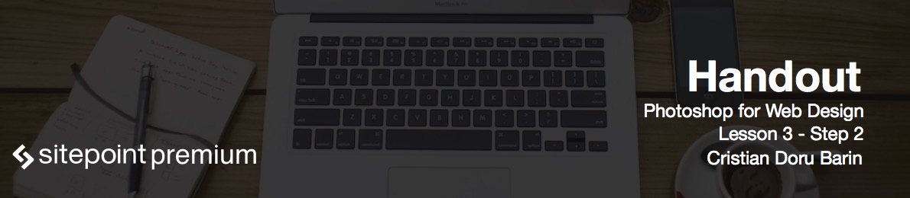
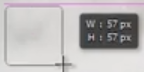
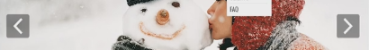
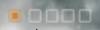
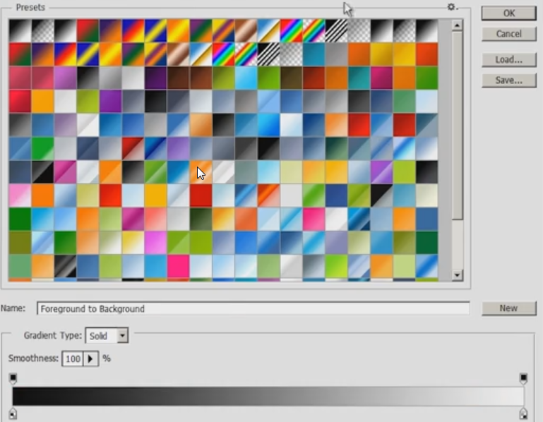
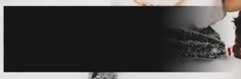
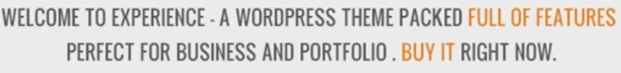

# Creating a clipping mask

The hero area is important because it makes the first impression.

* Draw a rectangle as wide as the one pixel grey line. Make the height decent, so most photos will fit.
* Get a high quality photo and drag it on into the canvas above the rectangular layer you just made.
* Press `Ctrl+Alt+G` to create a clipping mask.
* Use `Ctrl+T` to resize the picture if needed.

# Designing the hero area

For the controllers, the arrows, and boxes:

* Make a round rectangle.
* Draw a shape.

* Lower its opacity.
* Then get an arrow either from IconFinder or from your custom shapes.
* If you draw an arrow and it doesn't go onto a separate layer, hit `Ctrl+Shift+H` or just select another layer that isn't a shape.
* Group the element and use `Ctrl+J` to duplicate it or use `Alt+Shift` and drag it to the other side.
* Hit `Ctrl+T` and flip horizontally.

For the top right squares:

* Hit the `U` key and drag a white square.
* Add a 1 pixel stroke from the fx panel.
* Set the fill to 0%.
* Copy them with `Alt+Shift+drag`.
* For the active one, just make the stroke orange, plus add a smaller square in the middle.
* Group and rename as always.

# Designing the message

Messages and slideshows:

* Drag a rectangle.
* Make sure it has 100% opacity and fill.
* Clear layer styles if it has any.
* Press the mask button and select gradient.

* The colors will be black and white. Set the settings like this

* Hold `Shift` and drag. Do it multiple times until you see it fading away.

* Add the text by pressing `T` and writing. Make sure you don't click inside a shape.
* For a short description use dummy text from [lipsum.com](http://lipsum.com).

# Adding a caption

Finally let's add a big caption in the center of the screen. Here you can usually put a call to action which means you guide the user to do something: for example, a button inviting to sign-up.

* Put some words in orange to show they are links.
* Add grey horizontal lines and space them out using `Shift`.

