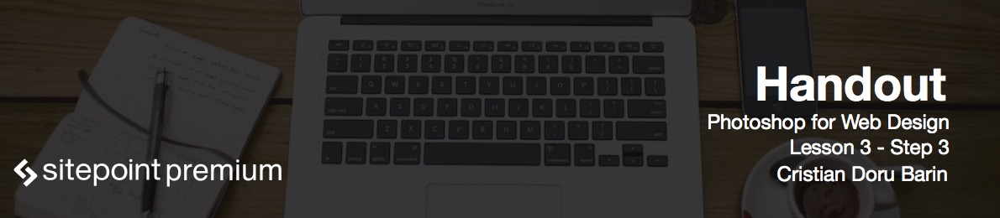
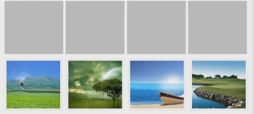

# Design recent projects

We want four items decently spaced.

* Make a rectangle.
* Align it to the left side.
* Copy it multiple times with `Alt+Shift` and align the last one on the right side.
* Then select them all and use Distribute Horizontal Centers.
* If the space is not right, hit `Ctrl+T` to resize all of them.
* Align the last one again and distribute to see the new result.

* Move those four squares up.
* Create a rectangle that's as wide as the top one and make it grey.
* Create another one. Make it black and center it inside the grey one.
* You should have two to three pixel space on each side.
* Add an image over the black square.
* Hit `Ctrl+Alt+G`, `Ctrl+T`, to resize if needed, and it's done.
* Group and name it.
* Use the `Alt+Shift` technique and copy it three more times.
* Select each image with `Ctrl+click`, and drag another one into place.

# Creating hover state for projects

The first image is the hover state, so we'll need to create a zoom icon.

* Use the ellipse tool, hold `Shift`, and drag.
* Lower the opacity.
* Get a magnifier icon from IconFinder.

Now we need to make the three other images black and white.

* Get the Marquee tool, drag and select the items.
* Add an adjustment layer, Black and White.
* Group and rename.
* Add the separator (you can find it in the *resources* folder).
