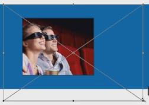

# Creating a clipping mask

What is a **clipping mask**? The best way to understand it is to see it in action. Draw two shapes on the screen and while on the top layer, press `Ctrl + Alt + G` to create a clipping mask. Only a part of the top shape will be visible, the area which intersects with the bottom layer.

This is great when you want to constrain an image within a certain shape or size. This works great when creating thumbnails.

# Creating a thumbnail gallery with clipping mask

Suppose we have a background and we want some pictures displayed in gallery fashion. How should we proceed?

* Draw a rectangle and add a stroke to it; adjust the color based on your background color.
* Grab an image from our PC and drag it into Photoshop.
* Adjust the position of the image: make sure it's above our shape and press `Ctrl+Alt+G`. The image will be constrained to that shape and size.
* If needed, press `Ctrl+T` and adjust the image size so it fits better.

* Group these two layers with `Ctrl+G` and use the `Alt+Shift` drag technique to duplicate it.
* Use Distribute Horizontal Centers.
* Select the second thumbnail and drag another image into place.
* Adjust it, if needed, and be sure to remove the previous image.
* Repeat until you have replaced all the images.
* To make the thumbnail look even nicer, we can duplicate the initial shape (let's call it "outer image") and use `Ctrl+T` to make it small by using `Alt` and `Shift`. The idea is to have an empty space of two to three pixels that will act like a frame.
* Depending on the image, you might want to adjust the stroke or remove it completely.
* Also you may add a small drop shadow to the outer image folder. Go to the effects panel, select Drop Shadow, and play with the settings until you find a nice, subtle shadow.

Remember to always use `Ctrl+Alt+G`, but just in case you forget, you can right-click on a layer and select Create Clipping Mask.