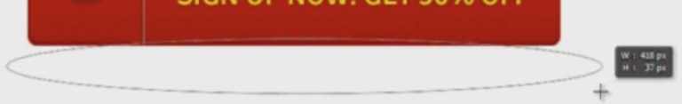

# Introduction

A **call to action** is usually a button or sometimes a form which directs the user to make an action.

# Designing a call to action button

In order to create a call to action button, we'll start off with a basic shape. I generally recommend you stay away from the square button, since they don't look as nice as the slightly rounded ones.

* Select a rounded rectangle tool and set the radius to 5 pixels.
* Draw a decent size button, pretty wide and tall enough that it can hold two lines of text.
 
The next steps are very similar - we've seen them when creating the main menu.

* Go the fx panel and select a gradient. A predefined one is fine at this point. What we're looking for is a nuance, that will allow me to use white text with great legibility.
* Set a stroke that's darker than the actual color. Sometimes, you can go with a color at the very bottom of the gradient.Usually, that works quite well.
* Add a bevel and emboss effect (adjust only size and color).

Now let's add some text:

* Press `T` and click once.
* Type something like "Get Started".
* Select a font (I usually recommend you use a font that has multiple weights).
* Add a subtle drop shadow to increase it's visibility.
* Add a second line of text that is a short message like "sign up right now", "get 50% off" etc.

The second line should usually have a different color than the first line and it should always be smaller. We're going to need a good contrasting color, so something like yellow should do a good job. Make sure you decrease the size and it's probably best to have a font weight set to normal, since bold text isn't that legible.

Drop shadows are generally not recommended for small text, but if you can make it look right, go for it.

To make sure your two lines of text are centered vertically:

* Group them.
* Use the Align Horizontal Centers tool up top. This way you won't have a different gap up top and another at the bottom.

Let's add an arrow now.

* Inside the custom shapes panel look for a decent arrow or symbol of some sorts that represents action, movement.
* Once you're done, hold down `Shift` and drag.
* Make it white and if needed, add a small drop shadow.

Now let's arrange the text and add a separator.

* Get the line tool.
* Drag a line.
* Use the `Alt+Shift+drag` technique to duplicate.
* Make one black and the other white.
* Adjust the opacity.

You could make the arrow symbol darker than the button color:

* Go to the fx panel.
* Select Inner Shadow. It will add a shadow on the inside of the shape so it looks like it's pressed in the button.
* Size and distance should be fairly low in order to make it look good: 1 to 3 pixels is probably enough.

Duplicate the button by pressing `Ctrl+J` - it's always good to have a copy just in case. Now hide one of the layers and continue working on the visible one.

Convert the button to a Smart Object. This is needed because certain effects completely mask others. For example, you can't have both color overlay and gradient, or a gradient and a pattern. Now we can add more effects:

* Go to the fx panel and select Pattern
* Get one that will look good with a low opacity. The key here is subtlety: you don't want anything crazy that will stand out too much.
* Just in case you don't find anything that works or that you like, you can use the Filter > Noise and set it to 1%.

# Adding a drop shadow

Let's make the button look like it's sitting on a floor. We could use a drop shadow but I want something better.

* Set black for the color.
* Get the ellipse tool.
* Drag a shape. The layer should go underneath your button.

* Select both layers and center them.
* Go to Filter > Blur > Gaussian Blur and press OK. The radius should be adjusted depending on the button; 5% to 7% is usually a pretty good choice.
* Lower the opacity to make it less obvious, and if needed, re-position it.
* Press `Ctrl+T` and flatten it a bit if you wish.

You really have a lot of options here. You can make the button seem like it's floating by creating a darker, more intense shadow and having a bit of a gap between them.

You can also have a very subtle shadow very close to the button. It depends on what you want to do in your design.

# Creating reflection of the button

One final thing you could do is create a reflection of the button.

* Group all the layers into a folder, if you haven't done so already. The shadow can be left out.
* Duplicate that group with `Ctrl+J`.
* Press `Ctrl+T` and hit Flip Vertically.
* Drag it underneath the button, both on the layers panel and in the canvas.
* Add a layer mask.

* Press `G` and select a gradient.
* Make sure it's linear from the top panel.
* Drag a bit, and release. A nice fading effect will be added to the button.
* Drag a few more times, until you get the perfect reflection, then make sure you try different starting points and different lengths.
* Lower the opacity to make it more subtle.

