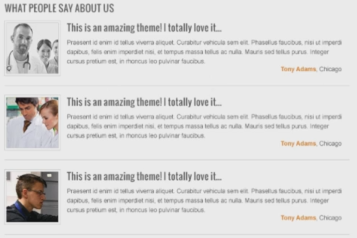

# Designing testimonials

For the thumbnail:

* Once again create square inside square.
* Add a picture above it
* Use `Ctrl+Alt+G`.
* Add a grey stroke to the outer square (`#D9D9D9`).
* Add the title.
* Add some dummy text.
* Adjust the height spacing.
* Add the name of the person and city.
* Add another grey line at the bottom.
* Group it.
* Copy it two times.
* Select them all and hit Distribute Vertical Centers to have the same space between them.
* Change the pictures and the titles so it will look better.
* Make the pictures black and white with an adjustment layer.
* To make sure the whole design doesn't become black and white, group the thumbnail layers, and add the adjustment to that folder with `Ctrl+Alt+G`.

# Designing twitter feed and company information

Make the Twitter feed using the same techniques:

* Use IconFinder for the icon.
* Add some dummy texts, but with some links inside.
* Adjust the height spacing if needed.

Same goes for the company information, so try that yourself.

# Designing about us, services and latest news areas

The about us, services we offer, and latest news require the same techniques as before.