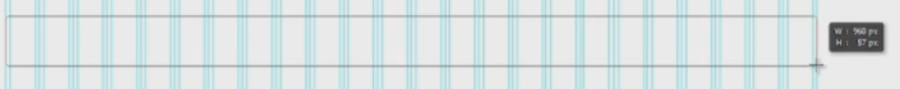
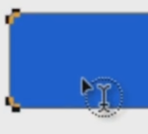
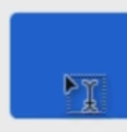
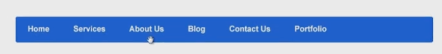

# Designing the main menu

Open up your 960 Grid file.

* Show the guides with `Ctrl+;` so we know how wide our menu should be.
* Lock them with `Ctrl+Alt+;`.
* Select the rounded rectangle tool. Use the hotkey `U` and `Shift+U` to scroll through the other shapes.
* Adjust the radius to 4 pixels. The bigger the radius, the rounder the shape will be. At 4 pixels, it's almost square,so there will be a subtle roundness to the menu.
* Make sure you have Align Edges option checked.
* Choose a blue color from the left side.
* Start from the left side and drag all the way to the other side, giving the shape a decent height.

* Press `Ctrl+A` and center the shape by using Align Horizontal Centers.

We need to check if the edges of the shape touch the outer guides.

* Press `Z` and zoom in as close as necessary.
* If the menu isn't as wide as it should be, align it to one side.
* Press `A` for the Direct Selection Tool to resize the shape.
* Start from the inside and drag out.
* Hold `Shift` and do the same for the other corner.
* Now go to the edge and drag. Hold `Shift` to make sure you drag in a perfect line.

Why are we using this technique and not `Ctrl+T` (Free Transform)? We have round corners and if we employ Free Transform, the radius will no longer be 4 pixels and the shape will lose its nice roundness.

It is time to add some text. Press `T` to select the Type Tool. If you go over the shape, you'll notice that cursor has a round shape next to it.

This means that you can write inside the shape. For now click outside the shape, write, and move the text into place.

You can use a `Ctrl+Shift+H` combination and write over the shape. The cursor will change and have a square near it.

Why do you need to use the `Ctrl+Shift+H` combination? Suppose there is a shape and we want to add a light grey stroke to it. The stroke won't be clearly shown because of the highlighting action. To get rid of it you need to use `Ctrl+Shift+H`.

Write a couple of items on the shape and have one space between each of them. After you've set them all, go at the end of the item, press `Space` a couple of times, select the empty space, and then paste it between the other elements. This is how you make sure you have the same space between each menu item.

Use the `Enter` button from the right side of your keyboard to commit the changes.

Select both layers by using `Ctrl` and center them by height or vertically. The vast majority of menus start from the left side to the right, so you don't need to center the text horizontally.

The text is looking very basic, so open the Character panel. You should have it on the right side, but if not, just go to Windows > Character. Set the font to Arial, Bold, 16 pixels, white, with a sharp anti-aliasing. One thing to note is that navigation items should have small type: Arial, 16px is pretty good, or Arial 13px with all caps is another good way to go. The mistake most designers make is setting the font to something like 30 pixels. On the other hand, we don't want to hinder the visibility in any way, so this is why we always use strong contrasting colors. This is why I generally recommend you stick with fairly dark background colors and pure white text.

# Adding a gradient to menu

Now let's make the menu look nicer. First, add a gradient from the fx panel. You can either create your own, or use a predefined one.

* Go to Gradient, click and select the first one.
* Set one side of the gradient to blue.
* Go to the other end and set the same color, but make it a bit lighter.

We have a nice 3D effect which is dead simple to make.

* Go to Stroke, select the initial blue and make it slightly darker.
* Set the size to 1 pixel
* Make the Stroke appear on the outside of the shape.

Now let's work with bevel.

* Go to Bevel and Emboss.
* Change the size from 5 to 2 pixels
* Change the color from black to blue.

# Creating menu item separators

The next step is to add some separators between the menu items. This is optional if your items are very far from other.

* Select the Line tool from the left panel.
* Set weight to 1 pixel and zoom in close.
* Drag a vertical line from the top of the menu to the bottom.
* Change the color to black.
* Duplicate the shape by pressing `Ctrl+J`.
* Press `V` and move it 1 pixel to the right.
* Change the color to white.
* Set the opacity to about 10% for the dark line and 20% for the light one. Of course these percentages might need to be changed, based on your background.
* Select both lines and group them with `Ctrl+G`.
* Press `M` for the marquee tool and make sure we have the square one selected.
* Zoom in real close, and drag a shape between two items.
* Press `V`, and if you have the separator group selected, you should be able to center it by using Align Horizontal Centers.
* Use `Alt+Shift` and drag. This will duplicate the group while moving it in a straight line.
* Center each separator.
* Group all the separators into one folder, and call that "separators".

# Creating hover state for menu items

Get a "hand" cursor from [iconfinder.com](http://iconfinder.com) and drag it into the project.

Let's create the hover state for an item.

* Press `T` and select an item.
* Go to the Character panel, and change it's color to something that shows the hover state (yellow, for example).
* Get the Marquee tool by pressing `M` and drag a shape between two separators.
* Go to the bottom and next to the fx panel click on this icon to add an adjustment layer:

* Select Brightness and Contrast.
* Play with brightness to get a hover state for your menu.

You can do the same thing for the down state which shows the page you're currently on. Suppose we're on the home page so use `Alt+Shift` and drag and copy this effect. This time it will bet the opposite of the hover state. It's a good idea to make the down state darker, and the hover state lighter. Try to do that yourself.

In case you want extra visibility for the text, select its layer, go to the Effects panel, and select Drop Shadow. I recommend you use something like this:

* 1 or 2 pixels for distance.
* 1 or 2 pixels for size.
* The color should be darker than the background.
* Play with the opacity to make the shadow more or less obvious.