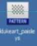

# Introduction

Sometimes when you search for resources, you might see patterns or gradients that have this icon.

To add them to Photoshop, you need to double click them.

# Define a pattern from image

But, sometimes, instead of getting a pattern in this format, you might download something like a basic image. To use that as a pattern in Photoshop:

* Hit `Ctrl+O`
* Select the image.
* Go to the Edit menu up top and select Define Pattern.
* Hit OK.

Now when you open up your fx panel, your new pattern will be there, with the name you've chosen.